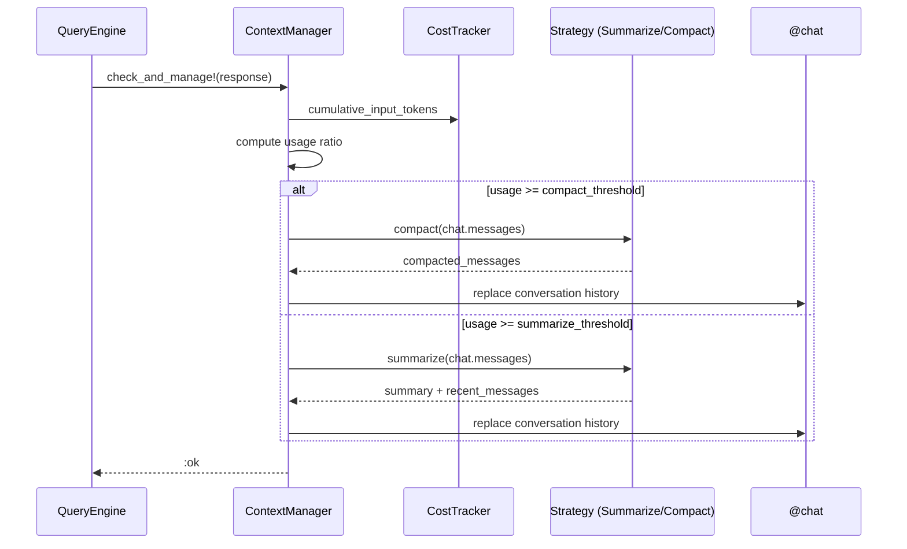

# Design Document: Context Window Management

## Overview

A context management system that monitors token usage against the model's context window limit and automatically triggers summarization (at a configurable threshold, default 25%) and compaction (at a configurable threshold, default 50%) to keep conversations within bounds. Strategies for both summarization and compaction are user-pluggable.

## Architecture

```mermaid
graph TD
    QE[QueryEngine] --> CM[ContextManager]
    CM --> TH[Thresholds]
    CM --> ST[Strategy Interface]
    ST --> DS[DefaultStrategy]
    ST --> CS[Custom Strategy]
    DS --> LLM[RubyLLM Chat]
    CM --> CHAT[@chat.messages]
    QE --> CT[CostTracker]
```

The ContextManager sits between the QueryEngine and the chat object. After each LLM response, QueryEngine calls `check_and_manage!` which compares cumulative input tokens against the configured thresholds and delegates to the pluggable Strategy when action is needed.

## Components and Interfaces

- **ContextManager** — Monitors token usage ratio, triggers strategies at thresholds
- **Strategy (module)** — Interface defining `summarize` and `compact` methods
- **DefaultStrategy** — Built-in implementation that uses the LLM to generate summaries
- **Thresholds** — Value object holding the two configurable ratios
- **Settings extensions** — New `summarize_threshold`, `compact_threshold`, `context_strategy` attributes

## Data Models

### Message Hash

```ruby
# Messages passed to/from strategies
{ role: "user" | "assistant" | "system", content: String }
```

### Thresholds Value Object

```ruby
Context::Thresholds.new(summarize_ratio: 0.25, compact_ratio: 0.50)
# Validates: summarize_ratio < compact_ratio, both in 0.0..1.0
```

### Stream Events

```ruby
Models::ContextSummarized.new(usage_ratio: Float, messages_before: Integer, messages_after: Integer)
Models::ContextCompacted.new(usage_ratio: Float, messages_before: Integer, messages_after: Integer)
```

## Main Algorithm/Workflow



## Core Interfaces/Types

```ruby
module Openharness
  module Rb
    module Context
      # Strategy interface — user implements this to provide custom behavior
      module Strategy
        # Summarize older messages into a condensed form.
        # Called when usage crosses the summarize threshold.
        #
        # @param messages [Array<Hash>] full conversation messages
        # @param opts [Hash] :model, :context_window, :current_tokens
        # @return [Array<Hash>] replacement messages (typically summary + recent)
        def summarize(messages, **opts)
          raise NotImplementedError
        end

        # Compact the conversation more aggressively.
        # Called when usage crosses the compact threshold.
        #
        # @param messages [Array<Hash>] full conversation messages
        # @param opts [Hash] :model, :context_window, :current_tokens
        # @return [Array<Hash>] replacement messages (minimal set)
        def compact(messages, **opts)
          raise NotImplementedError
        end
      end

      # Configuration value object for thresholds
      class Thresholds
        attr_reader :summarize_ratio, :compact_ratio

        # @param summarize_ratio [Float] 0.0..1.0, default 0.25
        # @param compact_ratio [Float] 0.0..1.0, default 0.50
        def initialize(summarize_ratio: 0.25, compact_ratio: 0.50)
          raise ArgumentError, "summarize_ratio must be < compact_ratio" unless summarize_ratio < compact_ratio
          raise ArgumentError, "ratios must be between 0 and 1" unless (0..1).cover?(summarize_ratio) && (0..1).cover?(compact_ratio)

          @summarize_ratio = summarize_ratio
          @compact_ratio = compact_ratio
        end
      end

      # The main coordinator
      class ContextManager
        attr_reader :context_window, :thresholds, :strategy, :state

        # @param context_window [Integer] max tokens for the model
        # @param thresholds [Thresholds] summarize/compact ratios
        # @param strategy [Strategy] pluggable summarization/compaction logic
        def initialize(context_window:, thresholds: Thresholds.new, strategy: DefaultStrategy.new)
          @context_window = context_window
          @thresholds = thresholds
          @strategy = strategy
          @state = :normal  # :normal, :summarized, :compacted
          @cumulative_input_tokens = 0
        end

        # Called after each LLM response to check thresholds.
        #
        # @param chat [RubyLLM::Chat] the active chat object
        # @param response [RubyLLM::Response] latest response with token counts
        # @return [Symbol] :none, :summarized, :compacted
        def check_and_manage!(chat, response)
          update_token_count(response)
          ratio = usage_ratio

          if ratio >= @thresholds.compact_ratio
            apply_compaction!(chat)
            :compacted
          elsif ratio >= @thresholds.summarize_ratio && @state == :normal
            apply_summarization!(chat)
            :summarized
          else
            :none
          end
        end

        # Current usage as a fraction of context window.
        def usage_ratio
          return 0.0 if @context_window.zero?
          @cumulative_input_tokens.to_f / @context_window
        end

        # Reset state (e.g., on clear!)
        def reset!
          @cumulative_input_tokens = 0
          @state = :normal
        end

        private

        def update_token_count(response)
          @cumulative_input_tokens = response.input_tokens if response&.respond_to?(:input_tokens) && response.input_tokens
        end

        def apply_summarization!(chat)
          messages = extract_messages(chat)
          opts = { model: chat.model, context_window: @context_window, current_tokens: @cumulative_input_tokens }
          replacement = @strategy.summarize(messages, **opts)
          replace_history!(chat, replacement)
          @state = :summarized
        end

        def apply_compaction!(chat)
          messages = extract_messages(chat)
          opts = { model: chat.model, context_window: @context_window, current_tokens: @cumulative_input_tokens }
          replacement = @strategy.compact(messages, **opts)
          replace_history!(chat, replacement)
          @state = :compacted
        end

        def extract_messages(chat)
          chat.messages.map do |msg|
            { role: msg.role.to_s, content: msg.content }
          end
        end

        def replace_history!(chat, new_messages)
          # Clear existing messages and replay the compacted set
          chat.messages.clear
          new_messages.each do |msg|
            chat.messages << RubyLLM::Message.new(role: msg[:role].to_sym, content: msg[:content])
          end
        end
      end
    end
  end
end
```

## Key Functions with Formal Specifications

### Function 1: `ContextManager#check_and_manage!(chat, response)`

```ruby
def check_and_manage!(chat, response)
  update_token_count(response)
  ratio = usage_ratio

  if ratio >= @thresholds.compact_ratio
    apply_compaction!(chat)
    :compacted
  elsif ratio >= @thresholds.summarize_ratio && @state == :normal
    apply_summarization!(chat)
    :summarized
  else
    :none
  end
end
```

**Preconditions:**
- `chat` is a valid `RubyLLM::Chat` instance with accessible `.messages`
- `response` responds to `input_tokens` and returns a non-negative Integer
- `@thresholds` is initialized with valid ratios (summarize < compact, both in 0..1)
- `@strategy` implements both `summarize` and `compact` methods

**Postconditions:**
- Returns `:compacted` if usage_ratio >= compact_threshold (conversation is aggressively reduced)
- Returns `:summarized` if usage_ratio >= summarize_threshold AND state was `:normal`
- Returns `:none` if neither threshold is exceeded
- After `:summarized`, `@state` transitions to `:summarized` (won't re-summarize until compaction)
- After `:compacted`, `@state` transitions to `:compacted`
- `chat.messages` is replaced with the strategy's output on any action taken

**Loop Invariants:** N/A (no loops)

---

### Function 2: `ContextManager#usage_ratio`

```ruby
def usage_ratio
  return 0.0 if @context_window.zero?
  @cumulative_input_tokens.to_f / @context_window
end
```

**Preconditions:**
- `@context_window` is a non-negative Integer
- `@cumulative_input_tokens` is a non-negative Integer

**Postconditions:**
- Returns 0.0 if context_window is zero (avoids division by zero)
- Returns a Float in range [0.0, ∞) representing fraction of context used
- No side effects

**Loop Invariants:** N/A

---

### Function 3: `DefaultStrategy#summarize(messages, **opts)`

```ruby
def summarize(messages, **opts)
  return messages if messages.length <= 4

  # Keep system message (first) and recent messages (last 4)
  system_msg = messages.first if messages.first[:role] == "system"
  recent = messages.last(4)
  older = messages[1...-4] # everything between system and recent

  # Use the LLM to summarize older messages
  summary_text = llm_summarize(older, opts[:model])

  result = []
  result << system_msg if system_msg
  result << { role: "system", content: "[Conversation Summary]\n#{summary_text}" }
  result.concat(recent)
  result
end
```

**Preconditions:**
- `messages` is a non-empty Array of Hashes with `:role` and `:content` keys
- `opts[:model]` is a valid model identifier string
- Messages are ordered chronologically

**Postconditions:**
- If messages.length <= 4, returns messages unchanged (nothing to summarize)
- Otherwise returns: [system_msg?, summary_msg, ...last_4_messages]
- The summary message has role "system" and content prefixed with "[Conversation Summary]"
- Total message count is reduced to at most 6 (system + summary + 4 recent)
- No original messages are mutated

**Loop Invariants:** N/A

---

### Function 4: `DefaultStrategy#compact(messages, **opts)`

```ruby
def compact(messages, **opts)
  return messages if messages.length <= 2

  system_msg = messages.first if messages.first[:role] == "system"
  recent = messages.last(2)

  # Ultra-compact: single-sentence summary of entire conversation
  summary_text = llm_compact(messages[1...-2], opts[:model])

  result = []
  result << system_msg if system_msg
  result << { role: "system", content: "[Compacted Context]\n#{summary_text}" }
  result.concat(recent)
  result
end
```

**Preconditions:**
- `messages` is a non-empty Array of Hashes with `:role` and `:content` keys
- `opts[:model]` is a valid model identifier string

**Postconditions:**
- If messages.length <= 2, returns messages unchanged
- Otherwise returns: [system_msg?, compact_summary, ...last_2_messages]
- Total message count is reduced to at most 4 (system + compact + 2 recent)
- Summary is more aggressive than `summarize` — captures only key decisions and state

**Loop Invariants:** N/A

---

### Function 5: `resolve_context_window(model)` (helper)

```ruby
# Resolves the context window size for a given model from RubyLLM's registry.
# Falls back to the configured context_window_threshold from Settings.
#
# @param model [String] model identifier (e.g., "gpt-4o", "claude-sonnet-4-20250514")
# @return [Integer] context window token limit
def self.resolve_context_window(model)
  model_info = RubyLLM.models.find(model)
  model_info&.context_window || 100_000
rescue StandardError
  100_000
end
```

**Preconditions:**
- `model` is a non-nil String
- `RubyLLM.models` is available (gem initialized)

**Postconditions:**
- Returns a positive Integer representing the model's context window
- On any error or missing model, returns 100_000 as a safe default
- No side effects

**Loop Invariants:** N/A

## Algorithmic Pseudocode

### Integration with QueryEngine

```ruby
# In QueryEngine#initialize, after building @chat:
context_window = Context::ContextManager.resolve_context_window(@model)
thresholds = Context::Thresholds.new(
  summarize_ratio: settings.summarize_threshold,  # default 0.25
  compact_ratio: settings.compact_threshold        # default 0.50
)
@context_manager = Context::ContextManager.new(
  context_window: context_window,
  thresholds: thresholds,
  strategy: settings.context_strategy || Context::DefaultStrategy.new
)

# In QueryEngine#track_usage(response), after recording costs:
def track_usage(response)
  return unless response&.respond_to?(:input_tokens) && response.input_tokens

  @cost_tracker.record(
    input_tokens: response.input_tokens || 0,
    output_tokens: response.output_tokens || 0,
    cost: 0.0
  )

  # Check context thresholds and manage if needed
  action = @context_manager.check_and_manage!(@chat, response)
  emit_context_event(action) unless action == :none
end

# In QueryEngine#clear!:
def clear!
  @chat = build_chat
  @turn_count = 0
  @tool_called_this_turn = false
  @tool_used_in_query = false
  @context_manager.reset!
end
```

### Settings Extensions

```ruby
# Additional attributes in Config::Settings
attribute :summarize_threshold, Types::Float.default(0.25)
attribute :compact_threshold, Types::Float.default(0.50)
attribute :context_strategy, Types::Any.optional.default(nil)
```

### Default Strategy Implementation

```ruby
module Openharness
  module Rb
    module Context
      class DefaultStrategy
        include Strategy

        def summarize(messages, **opts)
          return messages if messages.length <= 4

          system_msg = messages.first if messages.first[:role] == "system"
          start_idx = system_msg ? 1 : 0
          recent = messages.last(4)
          older = messages[start_idx...(messages.length - 4)]

          summary_text = generate_summary(older, opts[:model])

          result = []
          result << system_msg if system_msg
          result << { role: "system", content: "[Conversation Summary]\n#{summary_text}" }
          result.concat(recent)
          result
        end

        def compact(messages, **opts)
          return messages if messages.length <= 2

          system_msg = messages.first if messages.first[:role] == "system"
          recent = messages.last(2)
          start_idx = system_msg ? 1 : 0
          older = messages[start_idx...(messages.length - 2)]

          summary_text = generate_compact_summary(older, opts[:model])

          result = []
          result << system_msg if system_msg
          result << { role: "system", content: "[Compacted Context]\n#{summary_text}" }
          result.concat(recent)
          result
        end

        private

        def generate_summary(messages, model)
          chat = RubyLLM.chat(model: model)
          chat.with_instructions("Summarize this conversation concisely. Preserve key decisions, tool results, and context the assistant needs to continue helping.")
          formatted = messages.map { |m| "#{m[:role]}: #{m[:content]}" }.join("\n\n")
          response = chat.ask("Summarize:\n#{formatted}")
          response.content
        end

        def generate_compact_summary(messages, model)
          chat = RubyLLM.chat(model: model)
          chat.with_instructions("Create an ultra-compact summary (2-3 sentences max). Include ONLY: the user's goal, key decisions made, and current state. Drop all details.")
          formatted = messages.map { |m| "#{m[:role]}: #{m[:content]}" }.join("\n\n")
          response = chat.ask("Ultra-compact summary:\n#{formatted}")
          response.content
        end
      end
    end
  end
end
```

## Example Usage

```ruby
# Example 1: Basic setup with defaults (25% summarize, 50% compact)
settings = Config::Settings.new(
  model: "claude-sonnet-4-20250514",
  summarize_threshold: 0.25,
  compact_threshold: 0.50
)
harness = Harness.new(settings: settings)
harness.query("Write me a complex application...") { |event| handle(event) }
# Context manager will automatically summarize/compact as thresholds are hit

# Example 2: Custom thresholds
settings = Config::Settings.new(
  model: "gpt-4o",
  summarize_threshold: 0.30,
  compact_threshold: 0.60
)

# Example 3: Custom strategy
class MyStrategy
  include Openharness::Rb::Context::Strategy

  def summarize(messages, **opts)
    # Keep only the last 10 messages, no LLM call
    system_msg = messages.first if messages.first[:role] == "system"
    result = system_msg ? [system_msg] : []
    result.concat(messages.last(10))
    result
  end

  def compact(messages, **opts)
    # Keep only system message and last user message
    system_msg = messages.first if messages.first[:role] == "system"
    last_user = messages.reverse.find { |m| m[:role] == "user" }
    result = system_msg ? [system_msg] : []
    result << last_user if last_user
    result
  end
end

settings = Config::Settings.new(
  model: "claude-sonnet-4-20250514",
  context_strategy: MyStrategy.new
)

# Example 4: Observing context management events
harness.query("Long conversation...") do |event|
  case event
  when Models::ContextSummarized
    puts "Context was summarized at #{event.usage_ratio * 100}% usage"
  when Models::ContextCompacted
    puts "Context was compacted at #{event.usage_ratio * 100}% usage"
  end
end
```

## Correctness Properties

*A property is a characteristic or behavior that should hold true across all valid executions of a system — essentially, a formal statement about what the system should do. Properties serve as the bridge between human-readable specifications and machine-verifiable correctness guarantees.*

### Property 1: Usage ratio correctness

*For any* non-negative cumulative_input_tokens value and positive context_window value, the usage_ratio SHALL equal cumulative_input_tokens / context_window, and updating the token count from a response SHALL correctly reflect the response's input_tokens in subsequent ratio computations.

**Validates: Requirements 1.1, 1.2**

### Property 2: Threshold validation

*For any* pair of Float values (summarize_ratio, compact_ratio), Thresholds construction SHALL succeed only when summarize_ratio < compact_ratio AND both values are within 0.0..1.0 inclusive; all other combinations SHALL raise ArgumentError.

**Validates: Requirements 2.3, 2.4, 2.5, 2.6**

### Property 3: Correct threshold-based dispatch

*For any* usage_ratio and ContextManager state, `check_and_manage!` SHALL invoke `compact` when ratio >= compact_threshold, invoke `summarize` only when ratio >= summarize_threshold AND state is `:normal`, and take no action otherwise.

**Validates: Requirements 3.1, 4.1**

### Property 4: Monotonic state transitions

*For any* sequence of `check_and_manage!` calls with non-decreasing token counts, the ContextManager state SHALL only progress in the order `:normal` → `:summarized` → `:compacted`, never backwards (except via explicit `reset!`).

**Validates: Requirements 5.1, 5.2, 5.3**

### Property 5: System prompt preservation

*For any* conversation messages array where the first message has role "system", both `summarize` and `compact` SHALL preserve that system message as the first element of their output.

**Validates: Requirements 3.2, 4.2**

### Property 6: Recent message preservation

*For any* conversation messages array of sufficient length, `summarize` SHALL preserve the last 4 messages unchanged and `compact` SHALL preserve the last 2 messages unchanged in their respective outputs.

**Validates: Requirements 3.3, 4.3**

### Property 7: Idempotency on small conversations

*For any* messages array with 4 or fewer elements, `summarize` SHALL return it unchanged; for any messages array with 2 or fewer elements, `compact` SHALL return it unchanged.

**Validates: Requirements 3.6, 4.6**

### Property 8: No mutation of input

*For any* input messages array passed to `summarize` or `compact`, the original array and its contained Hashes SHALL remain unmodified after the method returns.

**Validates: Requirements 6.5**

### Property 9: Reset restores initial state

*For any* ContextManager in any state with any cumulative token count, calling `reset!` SHALL set state to `:normal` and cumulative_input_tokens to zero.

**Validates: Requirements 5.4**

### Property 10: Error resilience preserves conversation history

*For any* Strategy that raises an error during `summarize` or `compact`, the ContextManager SHALL return `:none` and the chat's conversation history SHALL remain identical to its pre-call state.

**Validates: Requirements 9.1, 9.2, 9.4**

## Error Handling

### Strategy failure during summarization/compaction

**Condition**: The LLM call inside DefaultStrategy fails (network error, rate limit, invalid response)
**Response**: Catch the error, log a warning, return `:none` — do not modify conversation history
**Recovery**: Next response will re-check thresholds and retry

### Invalid thresholds configuration

**Condition**: User provides summarize_ratio >= compact_ratio or values outside 0..1
**Response**: Raise `ArgumentError` at Thresholds initialization (fail-fast)
**Recovery**: User corrects configuration

### Model not found in RubyLLM registry

**Condition**: `resolve_context_window` cannot find the model
**Response**: Fall back to `context_window_threshold` from Settings (default 100,000)
**Recovery**: Automatic, no user intervention needed

### Chat messages inaccessible

**Condition**: `chat.messages` is nil or doesn't respond to expected interface
**Response**: Return `:none`, log a warning
**Recovery**: Automatic on next call

## Testing Strategy

### Unit Testing

- Test `Thresholds` validation (invalid ratios raise errors)
- Test `ContextManager#usage_ratio` computation
- Test `ContextManager#check_and_manage!` state transitions with mock responses
- Test `DefaultStrategy#summarize` message slicing logic (without LLM calls)
- Test `DefaultStrategy#compact` message slicing logic (without LLM calls)
- Test `reset!` restores initial state

### Property-Based Testing

**Library**: rantly (Ruby property-based testing)

- For any valid messages array, `summarize` output always contains the system message (if present) and last 4 messages
- For any valid messages array, `compact` output always contains the system message (if present) and last 2 messages
- For any sequence of `check_and_manage!` calls with increasing token counts, state only moves forward (normal → summarized → compacted)
- `usage_ratio` is always non-negative and proportional to input_tokens

### Integration Testing

- End-to-end test: feed increasing token counts via mock responses, verify summarization triggers at threshold
- Custom strategy test: plug in a test strategy, verify it gets called with correct arguments
- Verify QueryEngine emits `ContextSummarized` / `ContextCompacted` events at correct times

## File Structure

```
lib/openharness/rb/context/
├── strategy.rb           # Strategy module (interface)
├── thresholds.rb         # Thresholds value object
├── context_manager.rb    # Main ContextManager class
└── default_strategy.rb   # DefaultStrategy implementation
```
